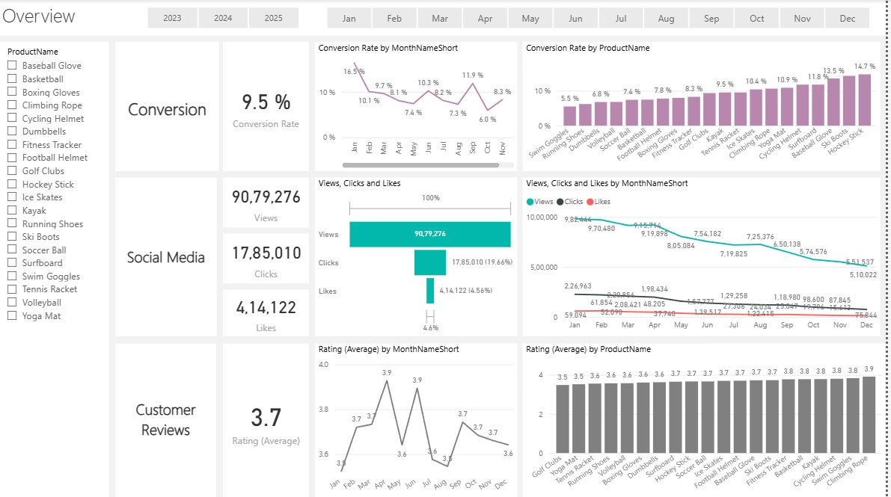
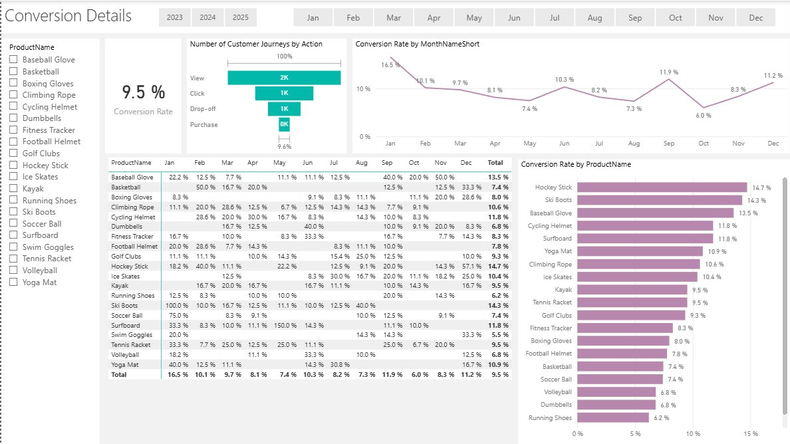
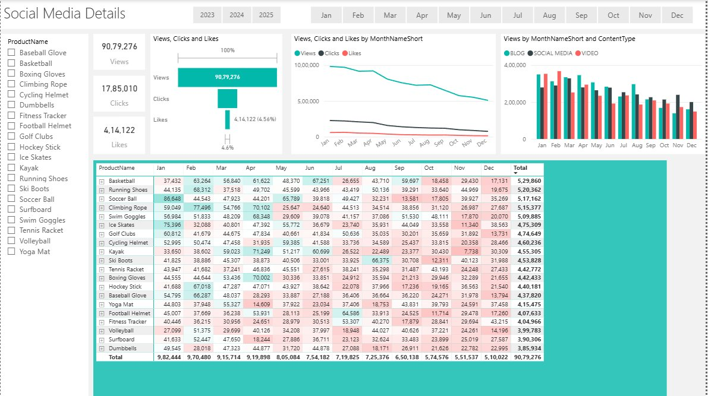
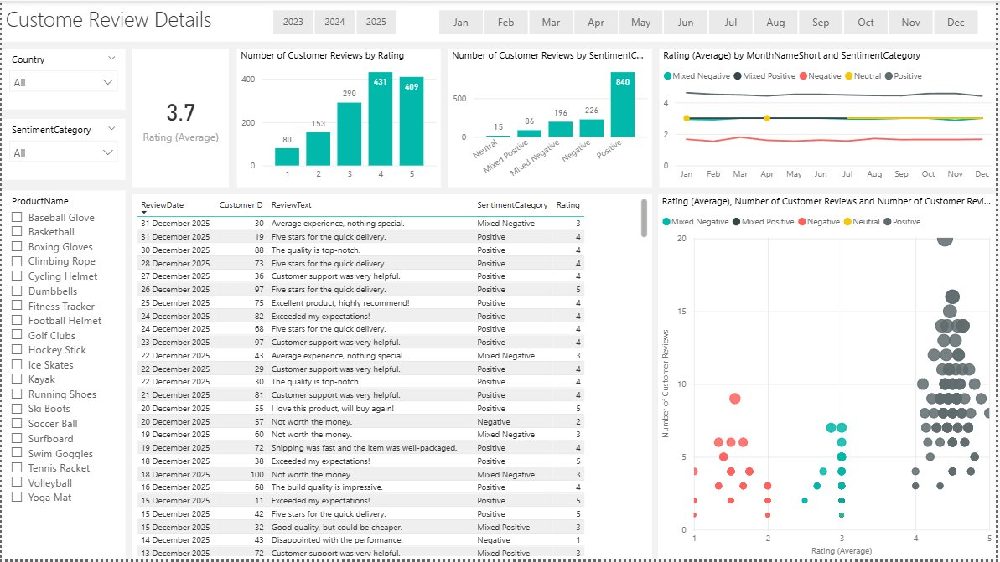

# Marketing Analytics: Customer Engagement, Journey & Sentiment Analysis

The primary goal of this project is to analyze customer behavior across three dimensions — their digital engagement with marketing content, their journey through the purchase funnel, and the sentiment expressed in their product reviews. By integrating data from SQL databases, enriching it with NLP-based sentiment analysis, and visualizing it through an interactive Power BI dashboard, this project enables data-driven decisions around customer retention, conversion optimization, and marketing campaign effectiveness.

---

## Details on the Dataset

Data was sourced from a relational SQL Server database (`Shopeasy_MarketingAnalytics`) and supplemented with CSV exports for analysis.

**Tables & Files:**

- `dbo.customers` — 100 customers with demographic and geographic references
- `dbo.geography` — 10 countries (UK, Germany, France, Spain, Italy, Netherlands, Belgium, Sweden, Switzerland, Austria) mapped to cities
- `dbo.customer_journey` — 4,011 records tracking customer interactions across funnel stages
- `dbo.customer_reviews` — 1,363 reviews with ratings (1–5) and free-text feedback
- `dbo.engagement_data` — 4,623 records of content engagement across campaigns and products
- `dbo.products` — Product catalog with pricing data

**Variable Overview:**

- `CustomerID`: Unique identifier for each customer (Nominal)
- `JourneyID`: Unique identifier for each customer interaction (Nominal)
- `Stage`: Funnel stage — Homepage, ProductPage, Checkout (Nominal)
- `Action`: Customer action at each stage — View, Click, Purchase, Drop-off (Nominal)
- `Duration`: Time spent on action in seconds (Numeric)
- `EngagementID`: Unique identifier for each content engagement (Nominal)
- `ContentType`: Type of content — Blog, Video, Social Media (Nominal, cleaned)
- `ViewsClicksCombined`: Raw combined field — split into Views and Clicks during SQL cleaning (Numeric)
- `Likes`: Number of likes on the content piece (Numeric)
- `ReviewID`: Unique identifier for each review (Nominal)
- `Rating`: Customer star rating from 1 to 5 (Ordinal)
- `ReviewText`: Free-text customer feedback (Text)
- `SentimentScore`: VADER compound score ranging from -1.0 to 1.0 (Numeric)
- `SentimentCategory`: Derived label — Positive, Negative, Neutral, Mixed Positive, Mixed Negative (Nominal)
- `Price`: Product unit price in currency (Numeric)
- `PriceCategory`: Derived — Low (<50), Medium (50–200), High (>200) (Ordinal)

---

## Approach

### 1. Data Extraction & SQL Cleaning

Raw data across five tables was extracted and cleaned using dedicated SQL scripts before being loaded into Power BI.

- **dim_customers.sql**: Joined `dbo.customers` with `dbo.geography` via `GeographyID` (LEFT JOIN) to enrich each customer record with country and city information.
- **dim_products.sql**: Added a `PriceCategory` column using a `CASE` statement — Low (< 50), Medium (50–200), High (> 200).
- **fact_customer_journey.sql**: Handled two key issues — duplicate records were identified using `ROW_NUMBER() OVER (PARTITION BY CustomerID, ProductID, VisitDate, Stage, Action)` and only the first occurrence was retained; 613 missing `Duration` values were imputed using `COALESCE(Duration, AVG(Duration) OVER (PARTITION BY VisitDate))`. Stage values were also standardized to uppercase using `UPPER()`.
- **fact_customer_reviews.sql**: Cleaned double-space formatting artifacts in `ReviewText` using `REPLACE(ReviewText, '  ', ' ')`.
- **fact_engagement_data.sql**: Split the combined `ViewsClicksCombined` field into separate `Views` and `Clicks` columns using `LEFT()`, `RIGHT()`, and `CHARINDEX()`; normalized `ContentType` casing inconsistencies (e.g., `Socialmedia` → `Social Media`) using `UPPER(REPLACE())`; excluded Newsletter content type as irrelevant to campaign analysis; and reformatted `EngagementDate` to `dd.MM.yyyy` using `FORMAT(CONVERT(DATE, ...))`.

### 2. Sentiment Enrichment (Python + VADER)

Customer review text was enriched with sentiment scores using the NLTK VADER (Valence Aware Dictionary and Sentiment Reasoner) model — well-suited for short, informal consumer text.

- Fetched review data directly from SQL Server via `pyodbc`
- Computed a compound `SentimentScore` for each review (range: -1.0 to 1.0)
- Applied a dual-signal categorization using both the sentiment score and the numerical `Rating` to produce nuanced labels rather than relying on text alone

**Sentiment Categorization Logic:**

| Sentiment Score | Rating | Category |
|---|---|---|
| > 0.05 (Positive) | ≥ 4 | Positive |
| > 0.05 (Positive) | = 3 | Mixed Positive |
| > 0.05 (Positive) | ≤ 2 | Mixed Negative |
| < -0.05 (Negative) | ≤ 2 | Negative |
| < -0.05 (Negative) | = 3 | Mixed Negative |
| < -0.05 (Negative) | ≥ 4 | Mixed Positive |
| Neutral | ≥ 4 | Positive |
| Neutral | ≤ 2 | Negative |
| Neutral | = 3 | Neutral |

- Assigned each review to a `SentimentBucket`: `0.5 to 1.0`, `0.0 to 0.49`, `-0.49 to 0.0`, `-1.0 to -0.5`
- Output saved to `fact_customer_reviews_with_sentiment.csv` and loaded into Power BI

### 3. Power BI Dashboard

All cleaned and enriched data was integrated into a four-page Power BI report connecting customers, products, journey, reviews, and engagement into a unified analytical view. Each page is filterable by year (2023–2025), month, and product.

---

#### Page 1 — Overview

A single-screen summary of all three analytical pillars: Conversion, Social Media, and Customer Reviews. Conversion rate sits at **9.5%** overall, with monthly variation visible from a high of 16.5% in January to a low of 6.0% in October. Social media engagement is dominated by views (90,79,276) with clicks converting at 19.66% and likes at 4.56% of total views. Average customer rating across all products is **3.7 / 5**, with Hockey Stick and Climbing Rope scoring highest.



---

#### Page 2 — Conversion Details

A deep dive into the purchase funnel broken down by product and month. Views and Clicks dominate journey volume, with Drop-offs and Purchases at roughly equal counts (~1K each). The month-wise conversion line chart shows a January peak (16.5%) followed by a sustained dip through mid-year.

- **Hockey Stick** leads all products with a 14.7% conversion rate, followed by Ski Boots (14.3%) and Baseball Glove (13.5%)
- **Running Shoes** (6.2%) and Soccer Ball / Basketball (7.4%) are the weakest converters
- The per-product monthly matrix reveals that Ski Boots achieved 100% conversion in January — driven by seasonal demand — while most products show sparse monthly data, indicating low purchase frequency per month



---

#### Page 3 — Social Media Details

Engagement broken down by product, content type (Blog, Social Media, Video), and month. Total views across all products and months: **90,79,276**, with a clear declining trend from ~9.8M in January to ~5.1M in December.

- **Basketball** leads total views (5,29,860) followed closely by Running Shoes (5,20,362) and Soccer Ball (5,17,162)
- **Dumbbells** (3,85,934) and Surfboard (3,90,306) sit at the bottom
- The content type breakdown shows Blog, Social Media, and Video contributing roughly equal monthly volumes, with all three following the same downward seasonal trend throughout the year



---

#### Page 4 — Customer Review Details

Sentiment analysis results visualized across ratings, categories, and time. Average rating is **3.7**, with the distribution skewed toward 4s (431 reviews) and 5s (409 reviews). Negative reviews (226) account for 16.6% of all reviews.

- **Positive** sentiment dominates at 840 reviews (61.6%), but **Mixed Negative** (196) and **Negative** (226) together represent a meaningful 30.9% of the review base
- The rating-vs-sentiment scatter plot reveals cases where high ratings coexist with negative sentiment text — the mixed categories surface exactly this misalignment that a star-rating-only view would miss
- Monthly sentiment trends remain relatively stable, suggesting no particular seasonal spike in dissatisfaction



---

## Data Model

The project follows a star schema structure centered around four fact tables and two dimension tables:

```
dim_customers (CustomerID, CustomerName, Email, Gender, Age, Country, City)
dim_products  (ProductID, ProductName, Price, PriceCategory)

fact_customer_journey  → links CustomerID + ProductID
fact_customer_reviews  → links CustomerID + ProductID + SentimentScore
fact_engagement_data   → links CampaignID + ProductID + ContentType
```

---

## Key Findings

- **Checkout is the biggest conversion leak** — overall conversion sits at 9.5%, with the funnel showing roughly equal drop-off and purchase volumes at the final stage. Hockey Stick (14.7%) and Ski Boots (14.3%) are the strongest converters; Running Shoes (6.2%) are the weakest.
- **Social media engagement declines sharply across the year** — views fall from ~9.8M in January to ~5.1M in December, suggesting campaigns are front-loaded and lose momentum through the year. Click and like rates remain consistently low at ~19.7% and ~4.6% of views respectively.
- **Sentiment is positive overall but Mixed categories reveal hidden friction** — 282 reviews fall into Mixed Positive or Mixed Negative buckets where star rating and text sentiment contradict each other, customers a rating-only system would misclassify entirely.
- **Average rating of 3.7 masks product-level variation** — the Overview page shows a spread from Golf Clubs (3.5) to Climbing Rope (3.9), which is actionable for targeted product quality or communication improvements.

---

## Tech Stack

| Tool | Purpose |
|---|---|
| SQL Server (T-SQL) | Data extraction, cleaning, deduplication, imputation |
| Python (pandas, NLTK VADER, pyodbc) | Sentiment scoring and categorization |
| Power BI | Four-page interactive dashboard |
| CSV | Intermediate data exchange between SQL, Python, and Power BI |

---

## Repository Structure

```
├── dim_customers.sql                    # Customer-geography join
├── dim_products.sql                     # Product price categorization
├── fact_customer_journey.sql            # Journey deduplication & duration imputation
├── fact_customer_reviews.sql            # Review text whitespace cleaning
├── fact_engagement_data.sql             # Engagement normalization & splitting
├── customer_reviews_enrichment.py       # VADER sentiment enrichment pipeline
├── fact_customer_reviews_enrich.csv     # Enriched reviews output
├── BI_Report.pbix                       # Power BI dashboard
├── Customers.csv
├── Geography.csv
├── Customer_Journey.csv
├── Customer_review.csv
└── Engagement_data.csv
```

---

## Conclusion

- This project built an end-to-end marketing analytics pipeline by combining SQL-based data cleaning across five relational tables with Python-based NLP sentiment enrichment and Power BI visualization. The result is a unified view of how customers discover, evaluate, and convert — or drop off — across the purchase funnel, covering 20 sports and fitness products across 10 European markets over three years.

- The dual-signal sentiment model, which cross-references VADER compound scores with star ratings, provides more reliable insight into customer satisfaction than either signal alone. A 5-star review with negative text and a 1-star review with positive language represent completely different operational situations — the Mixed categories surface exactly these cases, which a conventional rating-only dashboard would miss entirely.

- The declining social media engagement trend, the 9.5% overall conversion rate, and the 30.9% non-positive review share together point to three concrete priorities: re-energizing content campaigns in Q2–Q4, reducing checkout friction for low-converting products, and investigating the specific product and service issues driving negative and mixed reviews — all of which the Power BI dashboard is built to directly support.
